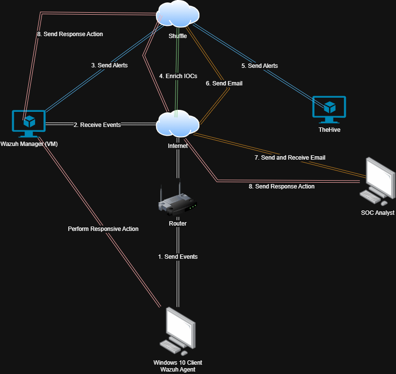
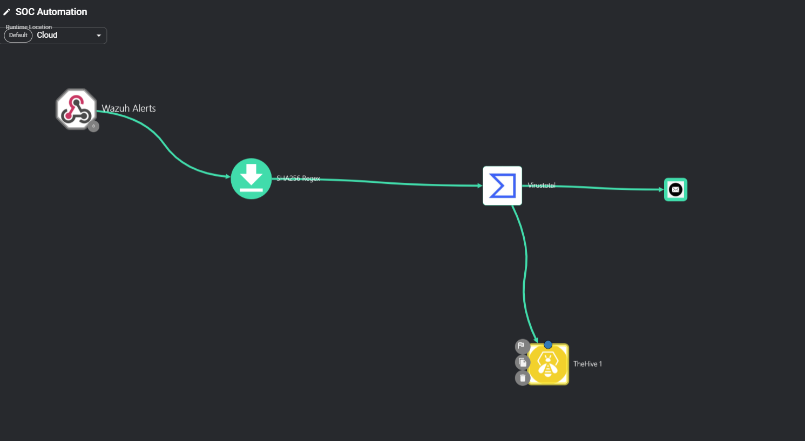

# SOC Automation Lab

## Overview
This project demonstrates the implementation of an automated Security Operations Center (SOC) workflow leveraging **on-premise virtual machines** with open-source tools: **Wazuh**, **The Hive**, and **Shuffle**. The setup is designed to detect, analyze, and respond to security incidents such as **Mimikatz activity** with minimal manual intervention, streamlining SOC operations.

## Objectives
1. **Automate Threat Detection & Response**: Reduce manual workload by automating incident detection and management.
2. **Integrate SOC Tools**:
   - **Wazuh** for monitoring and detection.
   - **The Hive** for case management.
   - **Shuffle** for orchestration and automation.
3. **Enable Real-Time Alerting**: Notify analysts via email/SMS for critical incidents.
4. **Enrich Alerts**: Use VirusTotal API for threat intelligence enrichment.

---

## Folder Structure
```
SOC-Automation-Lab/
├── README.md
├── LICENSE
├── docs/
│   ├── images/
│   ├── SOC_Workflow_Diagram.png
│   ├── SOC_Workflow_Diagram(Simple).png
│   ├── Shuffle_Workflow_Diagram.png
├── scripts/
│   ├── install_wazuh.sh
│   ├── install_hive.sh
│   ├── configure_cassandra.sh
│   ├── configure_elasticsearch.sh
│   ├── configure_hive.sh
│   ├── wazuh_mimikatz_rule.xml
│   ├── wazuh_ossec.conf
│   └── shuffle_workflow.json
├── configurations/
│   ├── ossec.conf
│   ├── cassandra.yaml
│   ├── elasticsearch.yml
│   ├── hive_application.conf
│   ├── sysmonconfig.xml
└── lab-setup/
    ├── VirtualBox_Wazuh_Setup.md
    ├── VirtualBox_Hive_Setup.md
    ├── Windows10_VM_Setup.md
    ├── Sysmon_Configuration.md
    ├── Shuffle_Setup.md
```

---

## Network Architecture & Workflow

### **Architecture Diagram**

This diagram represents the **end-to-end architecture** of the SOC automation setup. It illustrates how Wazuh collects logs from the Windows 10 client, sends them to Shuffle for enrichment, and ultimately logs alerts in The Hive for incident response.

### **Workflow Diagram**
.png)
This simplified diagram provides an **overview of the incident flow** from detection to resolution. It highlights the key steps in how security alerts move from detection (Wazuh) to enrichment (Shuffle) and case management (The Hive).

### **Shuffle Automation Workflow**

This **detailed visualization of the Shuffle workflow** shows how security alerts are processed, enriched with VirusTotal, and forwarded to The Hive. The workflow also includes email notifications for security analysts.

---

## Installation Guide

### **1. Prerequisites**
- Oracle VirtualBox installed.
- Ubuntu ISO for Wazuh and The Hive.
- Windows 10 ISO for client machine.
- Access to VirusTotal API (Free or Paid).

### **2. Setup Instructions**
#### **Step 1: Install Wazuh**
1. Create an **Ubuntu 24.04 VM** in VirtualBox.
2. Install Wazuh using the provided installation script.
3. Configure **ossec.conf** to forward logs to Shuffle.

#### **Step 2: Install The Hive**
1. Create an **Ubuntu 20.04 VM**.
2. Install necessary dependencies.
3. Configure **hive_application.conf** to connect with Wazuh.
4. Start The Hive service.

#### **Step 3: Setup Windows 10 VM**
1. Install **Sysmon** to capture detailed logs.
2. Configure Sysmon using **sysmonconfig.xml**.
3. Install the Wazuh agent and connect it to Wazuh Manager.

#### **Step 4: Configure Shuffle**
1. Register at [Shuffler.io](https://shuffler.io/).
2. Create a workflow for handling alerts.
3. Connect Shuffle to Wazuh and The Hive using API keys.

---

## Configuration Files
- **[ossec.conf](configurations/ossec_conf.xml)** → Wazuh configuration.
- **[cassandra.yaml](configurations/cassandra.md)** → Cassandra settings for The Hive.
- **[hive_application.conf](configurations/Hive_application_conf.md)** → The Hive configuration.
- **[sysmonconfig.xml](configurations/sysmonconfig.xml)** → Sysmon rules for Windows telemetry.
- **[shuffle_workflow.json](scripts/Shuffle_workflow.json)** → Workflow automation in Shuffle.

---

## Testing & Validation
1. **Run Mimikatz on Windows 10 VM**:
   - Wazuh should detect suspicious activity.
   - Alert should be forwarded to Shuffle.
   - Shuffle enriches the alert using VirusTotal.
   - The Hive should log a new security case.
   - Email/SMS notification should be triggered.

2. **Review The Hive**:
   - Verify case details and logs.
   - Initiate response actions.

3. **Confirm Automated Response**:
   - Wazuh should execute remediation steps (e.g., blocking IPs, terminating processes).

---
